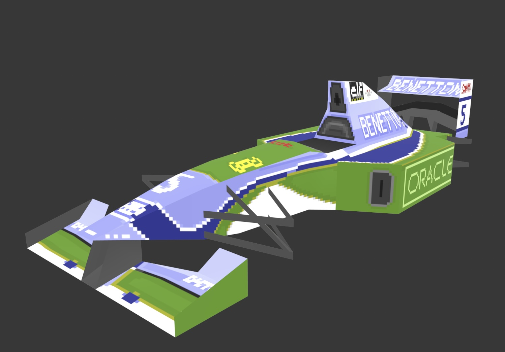

# Gpx2Obj

Welcome to my little 2025 rabbit-hole. Gpx2Obj is a ruby implementation the the [GP2 Careditor Carshape import by Paul Hoad](https://github.com/paulhoad/gp2careditor/) for GrandPrix2. The original editor does not provide an export of the model to OBJ to import it into other 3D tools. So I sat down a few weekends and reverse engineered his code, worked through [his carshape tutorials](https://grandprix2.de/Anleitung/tutus/carshape/carshape.html) and ported his code to Ruby. Why ruby? Simple because it's my main language and simple to read.

Features in this scripts:

- Read SHP GP2careditor carshape file
- Export both models: car 1 (low nose) and car 2 (raised nose)
- Assign UV-Mapping from YAML, CFG or SVG to OBJ model
- Export GP2careditor `Texture.cfg` to SVG

## Background

In 1995 Paul Hoad released his famous GP2careditor that allowed editing and sharing of GP2 car models. This was very much limited by how the game has the car model data embedded in the executable.
The careditor exports the original carshape by copying the binary data from the `GP2.exe` and then parsing the data structure to fetch the verticies, edges and faces. 

With the goal to export an ideally clean GP2 car to OBJ. It requires to:

1. Read the binary format SHP load the original vertex and face data.
2. Map this face data to a UV map.

The original UV mapping is also somewhere included in the original executable, but it has never been discovered.
GP2careditor helps itself by introducing a `texture.cfg` to assign all faces an UV mapping.
Paul included an attempt at a `texture.cfg` in the editor source code he released in 2020. However this is incomplete and includes mistakes. To fix this, I wrote a conversion to SVG and back, that allows editing the car's UV map.
Realistically, you'll never use this, as the mapping in GP2 can not be changed and thus, if the modding was done right once, there is no need to touch it again. 

## Project structure

- `assets/` basic assets for conversation:
    - `00-RC-44.png` example car texture
    - `carshape.shp` original carshape experted through [GP2careditor](https://github.com/paulhoad/gp2careditor/)
    - `model.mtl` shader settings for the OBJ model
    - `texture.cfg` improved texture uv mapping for use in GP2careditor
    - `uv_mapping.svg` SVG export of the UV map
- `lib/` Ruby source code
- `spec/` Ruby spec tests
- `Rakefile` describes the executable features

## Attention on wording
  
Careditor uses a language that mixes up todays common 3D terminology. 

- GP2careditor: Points -> Verticies
- GP2careditor: Verticies -> Edges
- GP2careditor: Texture -> Face

I'm using modern 2025 wording terms and will refer to verticies, edges and faces. Only within `Gpx2Obj::ShpReader` I will use the original terminology.

## Setup

Checkout this repository, make sure to have Ruby 3.4+ installed and run

    bundle install

## Usage

    rake gpx2obj:convert [input=assets/carshape.shp] [uv=assets/texture.cfg] [output=out/]

Run a conversion on a given model. By default it'll convert the standard GP2 shape.

## Development

    rake kaitai:recompile

Recompiles the `carshape.ksy`. The tool uses [Kaitai] to build binary readers from a description file. See [Kaitai Struct documentation](https://doc.kaitai.io/user_guide.html). This creates a ruby code to read the basic binary data of the carshape file. As the data format was highly optimized for performance, more data trickery is required to get the final data structure. This is done in ruby code only.

### Open Issues

The mapping is close to the original, but not perfect. All carbon parts are only mapped to one surface, while ingame you can draw eg on the suspensions.
Also I couldn't figure out if the textures map on the edge off a pixel or on the center of a pixel. I mapped to pixel center.
All of this can be adjusted to your needs by using your own uv mapping.

## Credits

- Thanks to [Paul Hoad](https://github.com/paulhoad/) for the leg-work 30 years ago. It was a pleasure to reverse-engineer your code and learn about binary formats from the 90s.
- [Boxy SVG](https://boxy-svg.com/) - an amazing little SVG editor. Contrary to other svg editors, it keeps the basic SVG intact after editing. So updating the UV-mapping became much much easier.
